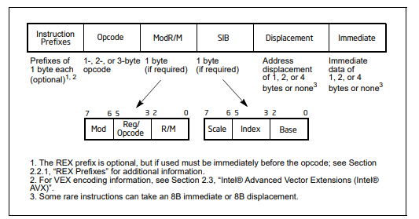

# Advanced Vector Extensions

Advanced Vector extensions are SIMD extensions to the x86 instruction set architecture. AVX uses 16 ymm registers to perform SIMD instructions. each ymm register holds

- 8 32-bit single-precision floating point numbers
- 8 32-bit integers
- 4 64-bit double-precision floating point numbers
- 4 64-bit integers

ymm0-15 are 16 registers obtained from the extension of the SSE xmm registers

| 511 - 256 | 255 - 128 | 127 - 0 |
| --------- | --------- | ------- |
| zmm0      | ymm0      | xmm0    |

AVX introduces a three-operand SIMD instruction format called **VEX Coding scheme**, which introduces a set of code prefixes that extends the opcode space allowing intructions
to have more than 2 operands

## Instructions Summary

Instructions supported by AVX/AVX2 are either 256 bits extensions of the preexisting 128 SSE(1..4.2) instructions or are new instructions all together

| Instruction | Description |
| -------- | --------- |
| `vbroadcastss`, `vbroadcastsd`, `vbroadcastf128` | copy a 32, 64, 128 bit memory operant to all elements of a ymm/xmm register |
| `vinsertf128` | replaces either the lower half or upper half of 256-bit ymm register with the 128-bit value from the source operand, the other half is unchanged |
| `vextractf128` | extracts either the lower half or upper half of the 256-bit ymm register and copies it in the 128-bit destination operand |
| `vmaskmovps`, `vmaskmovpd` | conditionally **reads** any number of elements from a SIMD vector memory operand into a destination register, leaving the remaining vector elements unread and setting the corresponding elements to zero. Alternatively, conditionally **write** any number of elements from a SIMD vector register operand to a vector memory operand, leaving the remaining elements of the memory operand unchanged |
| `vpermilps`, `vpermilpd` | *Permute In-Lane*. Shuffle the 32-bit or 64-bit vector elemens of one input operand. Shuffling can only happen within a 128-bit lane |
| `vperm2f128` | shuffle four 128-bit vector elements from 2 256-bit source operands into a 256-bit destination operand with an immediate constant as selector |
| `vtestps`, `vtestpd` | packed bit test of the packed single-precision or double-precision floating point sign bits, setting or clearing the ZF flag based on AND and CF on ANDN |

AVX2 introduces instructions focused on integers (and **permutations**). Here's a table for new instructions (leaving aside 256-bit extensions of SSE instructions):

| Instruction | Description |
| ----------- | ----------- |
| `vpbroadcastb`, `vpbroadcastsw`, `vpbroadcastd`, `vpbroadcastq` | broadcast a byte, word, doubleword, quadword to all elements of a xmm/ymm register |
| `vbroadcasti128` | copy 128-bit memory operand to all elements of a ymm register |
| `vinserti128`, `vinsertf128` | same as floating point counterparts |
| `vgatherdpd`, `vgatherqpd`, `vgatherdps`, `vgatherqps` | Gather single or double precision floating point values using either 32 or 64 bit indices and scale |
| `vpgatherdd`, `vpgatehrdq`, `vpgatherqd`, `vpgatherqq` | integer versions of gather instructions |
| `vpmaskmovd`, `vpmaskmovq` | integer versions of vector masked move |
| `vpermps`, `vpermd` | shuffle the eight 32-bit elements of one 256-bit source operand into a 256-bit destination operand |
| `vpermpd`, `vpermq` | shuffle the four 64-bit elements of one 256-bit source operand into a 256-bit destination operand |
| `vperm2i128` | same as `vperm2f128` |
| `vpblenddd` | extension of `pblend` function from SSE4 |
| `vpsllvd`, `vpsllvq` | Shift Left logical, variable shift according to the packed input |
| `vpsrlvd`, `vpsrlvq` | Shift Right Logical, variable shift according to the packed input |
| `vpsravd` | shift right arithmetic, variable shift according to the packed input |

## AVX Instruction Encoding

### Prerequisite: Operating Mode

The AMD64 architecture (canonical name of the 64-bit extension of the x64 architecture) supports 2 principal modes, *Long mode* and *Legacy Mode*. In Long Mode, when the
processor is running 64 bit code, its addresses are 64 bit wide and the Effective Addresses for memory reference are computed as follows

```math
\text{Offset} = \text{Base} + (\text{Index} * \text{Scale}) + \text{Displacement}
```

Common Usages

- $\textbf{Displacement}$: A displacement alone represents a direct (uncomputed) offset to the operand. Because the
  displacement is encoded in the instruction, this form of an address is sometimes called an absolute or static
  address. It is commonly used to access a statically allocated scalar operand.
- $\textbf{Base}$: A base alone represents an indirect offset to the operand. Since the value in the base register can
  change, it can be used for dynamic storage of variables and data structures.
- $\textbf{Base} + \textbf{Displacement}$: A base register and a displacement can be used together for two distinct purposes:

  - As an index into an array when the element size is not 2, 4, or 8 bytes—The displacement component
    encodes the static offset to the beginning of the array. The base register holds the results of a calculation
    to determine the offset to a specific element within the array.
  - To access a field of a record: the base register holds the address of the beginning of the record, while the
    displacement is a static offset to the field.

  An important special case of this combination is access to parameters in a procedure activation record. A
  procedure activation record is the stack frame created when a procedure is entered. Here, the EBP register is
  the best choice for the base register, because it automatically selects the stack segment. This is a compact
  encoding for this common function.
- $(\textbf{Index} ∗ \textbf{Scale}) + \textbf{Displacement}$: This address mode offers an efficient way to index into a static array
  when the element size is 2, 4, or 8 bytes. The displacement locates the beginning of the array, the index
  register holds the subscript of the desired array element, and the processor automatically converts the
  subscript into an index by applying the scaling factor.
- $\textbf{Base} + \textbf{Index} + \textbf{Displacement}$: Using two registers together supports either a two-dimensional array (the
  displacement holds the address of the beginning of the array) or one of several instances of an array of records
  (the displacement is an offset to a field within the record).
- $\textbf{Base} + (\textbf{Index} ∗ \textbf{Scale}) + \textbf{Displacement}$: Using all the addressing components together allows efficient
  indexing of a two-dimensional array when the elements of the array are 2, 4, or 8 bytes in size.

Each of these components, in long mode, 64-bit sub-mode, are:

- Displacement — An 8-bit, 16-bit, or 32-bit value.
- Base — The value in a 64-bit general-purpose register.
- Index — The value in a 64-bit general-purpose register.
- Scale factor — A value of 2, 4, or 8 that is multiplied by the index value

Instruction Format:



### Instruction Encoding

The VEX coding scheme uses a code prefix, the VEX Prefix (SSE uses the REX prefix), of 2 or 3 bytes depending on the instruction.
Instructions with the VEX prefix cannot use the LOCK prefix.

|   |   |   |   |   |   |   |
| - | - | - | - | - | - | - |
| \[prefixes\] | \[VEX\] | opcode | modR/M | \[sib\] | \[disp\] | \[imm\] |

- Mod R/M byte: encodes

  | Bit       | 7 6   | 5 4 3 | 2 1 0 |
  | -         | -     | -     | -     |
  | **usage** | "Mod" | "Reg" | "R/M" |

  - Addressing mode used for the register/memory operand (*Mod*, 2 bits). If mod is $11_2$, then "R/M" encodes a register. Otherwise, it specifies an addressing mode.
    Addressing mode in 64-bit mode is just an extension of the 32-bit mode combinations (According to the intel manual, volume 2A, paragraph 2.3)

The full table to know how all components are combined together is available in the intel manual, volume 2A, paragraph 2.3, table 2-2 and table 2-3.

## Documentation Links

- [AVX](https://www.intel.com/content/www/us/en/docs/cpp-compiler/developer-guide-reference/2021-9/details-of-avx-intrinsics.html)
- [AVX2](https://www.intel.com/content/www/us/en/docs/cpp-compiler/developer-guide-reference/2021-9/intrinsics-for-avx2.html)

## AVX SIMD Applications and examples

```cpp
#include <immintrin.h>  // Include AVX header

void vectorSum(float* A, float* B, float* C, int n) {
    // Loop for processing 8 elements at a time
    for (int i = 0; i < limit; i += 8) {
        // Load 8 elements from Arrays A and B into AVX registers (note load unaligned)
        __m256 avx_a = _mm256_loadu_ps(&A[i]);
        __m256 avx_b = _mm256_loadu_ps(&B[i]);

        // Perform vector addition
        __m256 avx_result = _mm256_add_ps(avx_a, avx_b);

        // Store the result back into Array C
        _mm256_storeu_ps(&C[i], avx_result);
    }
}

// there is also a dot instruction (which is slow as hadd)
float dotProduct(float* A, float* B, int n) {
    __m256 sum = _mm256_setzero_ps();
    for (int i = 0; i < n; i += 8) {
        __m256 a = _mm256_loadu_ps(&A[i]);
        __m256 b = _mm256_loadu_ps(&B[i]);
        sum = _mm256_add_ps(sum, prod);
    }
    // alternative: vhaddps instruction
    alignas(__m256) float temp[8];
    _mm256_store_ps(temp, sum); // note aligned store
    for (int i = 0; i < 8; ++i) result += temp[i];
    return result;
}

void normalizeVectors3(float* vectors, int count) {
    for (int i = 0; i < count * 3; i += 8 * 3) {
        // AOSOA Format!
        __m256 x = _mm256_loadu_ps(&vectors[i + 0]);
        __m256 y = _mm256_loadu_ps(&vectors[i + 8]);
        __m256 z = _mm256_loadu_ps(&vectors[i + 16]);

        __m256 len2 = _mm256_add_ps(_mm2526_add_ps(_mm256_mul_ps(x,x), _mm256_mul_ps(z,z)), _mm256_mul_ps(z,z));
        __m256 lenInv = _mm256_rsqrt_ps(len2);

        x = _mm256_mul_ps(x, lenInv);
        y = _mm256_mul_ps(y, lenInv);
        z = _mm256_mul_ps(z, lenInv);

        _mm256_storeu_ps(&vectors[i + 0], x);
        _mm256_storeu_ps(&vectors[i + 8], y);
        _mm256_storeu_ps(&vectors[i + 16], z);
    }
}
```
