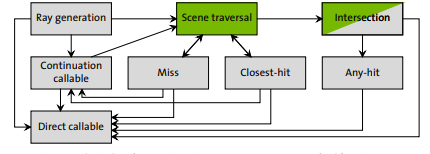
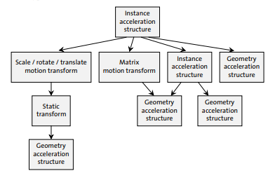

# Introduction

## Glossary
- **Program**: executable device come, termed shader by Graphics APIs like Vulkan (I'll call them shaders anyways)

Programs in the Ray Tracing Pipeline defined by OptiX
- **Ray Generation**: Entry point to the ray tracing pipeline, invoked in parallel for each pixel, sample or other user-defined work assignment (like Rays) (page 107)
- **Intersection**: Implements a ray-primitive intersection test, invoked dureing traversal (page 118)
- **Any Hit**: Called when a traced ray finds a new, potentially closest, intersection point, such as for shadow computation (page 118)
- **Closest hit**: Called when a traced ray finds the closest intersection point, such as for material shading (page 74)
- **Miss**: Called when a traced ray misses all scene geometry (perfect place for light at infinity evaluation) (page 127)
- **Exception**: Defines an exception handler for erroneous situations (page 127) 
- **Direct Callables**: (page 133) 
- **Continuation Callables**: Executed by a scheduler (perfect for Accumulating statistics about the rendering and the image) (page 133)

 Ray tracing pipeline

**Shader Binding Table**: Connects geometric data to programs. A *Record* a is a component of the table which is selected at runtime by using 
offsets specified when acceleration structures are created. A record is broken up into
- *Record Header*: Used to identify programmatic behaviour. A primitive, for example, would identify an intersection
- *Record Data*: Any data you need at program execution (example, a color)
```cpp
// 0. OptixDeviceContext context already created
// 1. Create program groups for each type of program you need
OptixProgramGroup raygen_progGroup = nullptr;

// then describe what each program is supposed to be
OptixProgramGroupOptions options{};
OptixProgramGroupDesc raygen_progGroupDescriptor = {};
raygen_progGroupDescriptor.kind = ::OPTIX_PROGRAM_GROUP_KIND_RAYGEN;
raygen_progGroupDescriptor.raygen.module = // CUmodule which contains the raygen function
raygen_progGroupDescriptor.raygen.entryFunctionName = // PTX .entry of __global__ fun (void(*)())
optixProgramGroupCreate(
    optixContext, 
    &raygen_progGroupDescriptor, 1/*count*/, 
    &options, 
    log, logSize, 
    &raygen_progGroup
);

// 2. Create shader binding tables
OptixShaderBindingTable sbt = {}; // see below, end of step 2
CUdeviceptr d_raygenRecord = 0;
cuMemAlloc(&d_raygenRecord, sizeof(RayGenSbtRecord)); // sbt = shader binding table
RayGenSbtRecord rg_sbt;

// I want to use this inside all raygen shaders (prepare the header on the host)
optixSbtRecordPackHeader(raygen_progGroup, &rg_sbt);
// arbitrary data. A color, in this example (prepare the data on the host)
rg_sbt.data = { 0.2f, 0.2f, 0.0f };
cuMemCpyHtoD(d_raygenRecord, &rg_sbt, sizeof(RayGenSbtRecord));
sbt.raygenRecord = d_raygenRecord;
```

**Ray Payload**: used to pass data between programs during ray traversal (page 129). Can be passed in both global memory or stack

**Primitive Attributes**: (same as vertex attributes in the graphics api) Used to pass arbitrary data to 
*Any Hit* and *Closest Hit* shaders. The predefined Triangle intersection routine pre-defines The triangle's 
barycentric coordinates (U, V).

**Buffer**: Optix's lingo for a `CUdeviceptr`

**Acceleration Structures**: Bounding Volume Hierarchy. There are 2 types
- *Geometry Acceleration Structure*: Built over primitive (triangle, curve, sphere or user-defined) 
(called bottom-level acceleration structure in Vulkan)
- *Instance Acceleration Structure*: Built over Motion Transform Nodes (which reference other geometry), allowing for instancing 
(called top-level acceleration structure in Vulkan)

**Opacity Micromaps**: records opacity information for a triangle (page 41)

## Traversing the Scene Graph
Optix Defines a scene as a Graph whose nodes are called *Traversables*. There are 5 types of Traversables:
- *Instance Acceleration Structure*
- *Geometry Acceleration Structure* (can only have 1 child of type geometry (page 33))
- *Static Transform* (There can be only one in any path, and their effect is nullified when there are motion transforms?)
- *Matrix Motion Transform*
- *Scaling, rotation, translation (SRT) Motion Transform*
Transform nodes are applied to all children



## Accessing the OptiX Libary
Accessing any OptiX function is done through `OptixFunctionTable`, which is recovered by looking at some DLL (`nvoptix.dll` windows, `libnvoptix.so.1` on linux). On 
linux, the file must be present in the search path, while on windows you can look into the OpenGL related registry values. Anyways, you shouldn't do this yourself, OptiX
ships with the function `optixInit` in the header `optix_stubs.h`, which 
- contains the `optixInit` function to ease the loading of the optix library
- Contains inlined function which directly call their counterparts from the global function table
```cpp
inline OptixResult optixDeviceContextCreate( CUcontext fromContext, const OptixDeviceContextOptions* options, OptixDeviceContext* context )
{
    return g_optixFunctionTable.optixDeviceContextCreate( fromContext, options, context );
}
```

# Context (page 21)

Manages a single GPU. Created with `optixDeviceContextCreate` and `optixDeviceContextDestroy`.

We can register a *log callback*, of type
```cpp
void(*OptixLogCallback)(uint32_t level, char const* tag, char const* message, void* data);
```
with the function `optixDeviceContextSetLogCallback`. This function is multithreaded and therefore must be thread-safe.
- TODO: Look in the debugger which thread calls this callback

**Compilation Caching**: When creating an `OptixModule`, `OptixProgramGruop`, `OptixPipeline`, their artifacts will be cached on disk. Functions 
to control the cache's behaviour
- `optixDeviceContextSetCacheEnabled`: Enables or disables caching on disk (*Lock the directory if enabled*). Note: The Environment Variable `OPTIX_CACHE_MAXSIZE`,
if set to 0, will effectively disable the cache, overriding this function
- `optixDeviceContextSetCacheLocation`: Sets the directory for the cache. Can be overridden by the environment variable `OPTIX_CACHE_PATH`
- `optixDeviceContextSetCacheDatabaseSizes`: sets low and high watermarks for *disk cache garbage collection*. Whenever, after an entry insertion in the cache, its
size goes beyond the high watermark value, then the library evicts cache entries until the low watermark is reached. The high and low watermark are overridden by
the environment variable `OPTIX_CACHE_MAXSIZE`, which, if set, it is used as high watermark, while the low watermark is set as (high watermark / 2)

**Validation Mode**: Validation Layers are additional, opt-in, controls done in the library routines. They reduce performance but help catching errors during tests
and debug. They are set by enabling them at context creation
```cpp
OptixDeviceContextOptions options = {}
options.validationMode = OPTIX_DEVICE_CONTEXT_VALIDATION_MODE_ALL;
```
Validation mode implicitly adds an Exception Program which reports all exceptions.