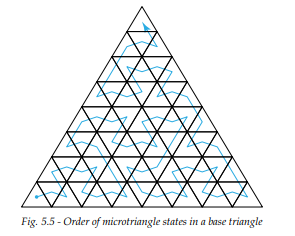

# Introduction

## Glossary

- **Program**: executable device come, termed shader by Graphics APIs like Vulkan (I'll call them shaders anyways)

Programs in the Ray Tracing Pipeline defined by OptiX

- **Ray Generation**: Entry point to the ray tracing pipeline, invoked in parallel for each pixel, sample or other user-defined work assignment (like Rays) (page 107)
- **Intersection**: Implements a ray-primitive intersection test, invoked dureing traversal (page 118)
- **Any Hit**: Called when a traced ray finds a new, potentially closest, intersection point, such as for shadow computation (page 118)
- **Closest hit**: Called when a traced ray finds the closest intersection point, such as for material shading (page 74)
- **Miss**: Called when a traced ray misses all scene geometry (perfect place for light at infinity evaluation) (page 127)
- **Exception**: Defines an exception handler for erroneous situations (page 127)
- **Direct Callables**: (page 133)
- **Continuation Callables**: Executed by a scheduler (perfect for Accumulating statistics about the rendering and the image) (page 133)

 Ray tracing pipeline

**Shader Binding Table**: Connects geometric data to programs. A *Record* a is a component of the table which is selected at runtime by using
offsets specified when acceleration structures are created. A record is broken up into

- *Record Header*: Used to identify programmatic behaviour. A primitive, for example, would identify an intersection
- *Record Data*: Any data you need at program execution (example, a color)

```cpp
// 0. OptixDeviceContext context already created
// 1. Create program groups for each type of program you need
OptixProgramGroup raygen_progGroup = nullptr;

// then describe what each program is supposed to be
OptixProgramGroupOptions options{};
OptixProgramGroupDesc raygen_progGroupDescriptor = {};
raygen_progGroupDescriptor.kind = ::OPTIX_PROGRAM_GROUP_KIND_RAYGEN;
raygen_progGroupDescriptor.raygen.module = // CUmodule which contains the raygen function
raygen_progGroupDescriptor.raygen.entryFunctionName = // PTX .entry of __global__ fun (void(*)())
optixProgramGroupCreate(
    optixContext, 
    &raygen_progGroupDescriptor, 1/*count*/, 
    &options, 
    log, logSize, 
    &raygen_progGroup
);

// 2. Create shader binding tables
OptixShaderBindingTable sbt = {}; // see below, end of step 2
CUdeviceptr d_raygenRecord = 0;
cuMemAlloc(&d_raygenRecord, sizeof(RayGenSbtRecord)); // sbt = shader binding table
RayGenSbtRecord rg_sbt;

// I want to use this inside all raygen shaders (prepare the header on the host)
optixSbtRecordPackHeader(raygen_progGroup, &rg_sbt);
// arbitrary data. A color, in this example (prepare the data on the host)
rg_sbt.data = { 0.2f, 0.2f, 0.0f };
cuMemCpyHtoD(d_raygenRecord, &rg_sbt, sizeof(RayGenSbtRecord));
sbt.raygenRecord = d_raygenRecord;
```

**Ray Payload**: used to pass data between programs during ray traversal (page 129). Can be passed in both global memory or stack

**Primitive Attributes**: (same as vertex attributes in the graphics api) Used to pass arbitrary data to
*Any Hit* and *Closest Hit* shaders. The predefined Triangle intersection routine pre-defines The triangle's
barycentric coordinates (U, V).

**Buffer**: Optix's lingo for a `CUdeviceptr`

**Acceleration Structures**: Bounding Volume Hierarchy. There are 2 types

- *Geometry Acceleration Structure*: Built over primitive (triangle, curve, sphere or user-defined)
(called bottom-level acceleration structure in Vulkan)
- *Instance Acceleration Structure*: Built over Motion Transform Nodes (which reference other geometry), allowing for instancing
(called top-level acceleration structure in Vulkan)

**Opacity Micromaps**: records opacity information for a triangle (page 41)

## Traversing the Scene Graph

Optix Defines a scene as a Graph whose nodes are called *Traversables*. There are 5 types of Traversables:

- *Instance Acceleration Structure*
- *Geometry Acceleration Structure* (can only have 1 child of type geometry (page 33))
- *Static Transform* (There can be only one in any path, and their effect is nullified when there are motion transforms?)
- *Matrix Motion Transform*
- *Scaling, rotation, translation (SRT) Motion Transform*
Transform nodes are applied to all children


## Accessing the OptiX Libary

Accessing any OptiX function is done through `OptixFunctionTable`, which is recovered by looking at some DLL (`nvoptix.dll` windows, `libnvoptix.so.1` on linux). On
linux, the file must be present in the search path, while on windows you can look into the OpenGL related registry values. Anyways, you shouldn't do this yourself, OptiX
ships with the function `optixInit` in the header `optix_stubs.h`, which

- contains the `optixInit` function to ease the loading of the optix library
- Contains inlined function which directly call their counterparts from the global function table

```cpp
inline OptixResult optixDeviceContextCreate( CUcontext fromContext, const OptixDeviceContextOptions* options, OptixDeviceContext* context )
{
    return g_optixFunctionTable.optixDeviceContextCreate( fromContext, options, context );
}
```

## Context (page 21)

Manages a single GPU. Created with `optixDeviceContextCreate` and `optixDeviceContextDestroy`.

We can register a *log callback*, of type

```cpp
void(*OptixLogCallback)(uint32_t level, char const* tag, char const* message, void* data);
```

with the function `optixDeviceContextSetLogCallback`. This function is multithreaded and therefore must be thread-safe.

- TODO: Look in the debugger which thread calls this callback

**Compilation Caching**: When creating an `OptixModule`, `OptixProgramGruop`, `OptixPipeline`, their artifacts will be cached on disk. Functions
to control the cache's behaviour

- `optixDeviceContextSetCacheEnabled`: Enables or disables caching on disk (*Lock the directory if enabled*). Note: The Environment Variable `OPTIX_CACHE_MAXSIZE`,
if set to 0, will effectively disable the cache, overriding this function
- `optixDeviceContextSetCacheLocation`: Sets the directory for the cache. Can be overridden by the environment variable `OPTIX_CACHE_PATH`
- `optixDeviceContextSetCacheDatabaseSizes`: sets low and high watermarks for *disk cache garbage collection*. Whenever, after an entry insertion in the cache, its
size goes beyond the high watermark value, then the library evicts cache entries until the low watermark is reached. The high and low watermark are overridden by
the environment variable `OPTIX_CACHE_MAXSIZE`, which, if set, it is used as high watermark, while the low watermark is set as (high watermark / 2)

**Validation Mode**: Validation Layers are additional, opt-in, controls done in the library routines. They reduce performance but help catching errors during tests
and debug. They are set by enabling them at context creation

```cpp
OptixDeviceContextOptions options = {}
options.validationMode = OPTIX_DEVICE_CONTEXT_VALIDATION_MODE_ALL;
```

Validation mode implicitly adds an Exception Program which reports all exceptions.

## Acceleration Structures (page 25)

There are 5 functions of acceleration structure

- `optixAccelComputeMemoryUsage`: Compute the required memory usage to build an acceleration structure. In particular, it inquires `outputSizeInBytes`, bytes needed by the uncompacted produced by build,
`tempSizeInBytes`, bytes used by the build procedure by Optix as a scratch buffer, and finally `tempUpdateSizeInBytes`, bytes needed in a build update operation
- `optixAccelBuild`: take an array of `OptixBuildInput` and the result from the memory computation usage to perform a streamed build operation
- `optixAccelRelocate`: Copy acceleration structure from a device memory position to another. Useful to propagate the acceleration structure among different devices.
- `optixConvertPointerToTraverableHandle`: The instances in a IAS can have their `CUdeviceptr` be casted into these handles, 64 byte aligned, which can be then traversed

Types:

- `OPTIX_BUILD_INPUT_TYPE_INSANCES`, `OPTIX_BUILD_INPUT_TYPE_INSTANCE_POINTERS`: *Instance Acceleration Structures* (IAS)
- `OPTIX_BUILD_INPUT_TYPE_TRIANGLES`: *Geometry Acceleration Structure* containing triangles (GAS)
- `OPTIX_BUILD_INPUT_TYPE_CURVES`: *Geometry Acceleration Structure* containing curve primitives
- `OPTIX_BUILD_INPUT_TYPE_SPHERES`: *Geometry Acceleration Structure* containing built-in spheres
- `OPTIX_BUILD_INPUT_TYPE_CUSTOM_PRIMITIVES`: *Geometry Acceleration Structure* containing custom primitives

Note: While GAS buffers are independent from input buffers, IAS builds will refer to other IAS/GAS structures and transform nodes

### Triangle Build Input

References an array of vertex buffer for each Motion Blur key (1 vertex buffer if there are no animations), plus an optional, single, Index buffer

```cpp
OptixBuildInputTriangleArray& buildInput = buildInputs[0].triangleArray;
buildInput.type = OPTIX_BUILD_INPUT_TYPE_TRIANGLES;
buildInput.vertexBuffers = &d_vertexBuffer;
buildInput.numVertices = numVertices;
buildInput.vertexFormat = OPTIX_VERTEX_FORMAT_FLOAT3;
buildInput.vertexStrideInBytes = sizeof(float3);
buildInput.indexBuffer = d_indexBuffer;
buildInput.numIndexTriplets = numTriangles;
buildInput.indexFormat = OPTIX_INDICES_FORMAT_UNSIGNED_INT3;
buildInput.indexStrideInBytes = sizeof(int3);
buildInput.preTransform = 0; 
```

where `preTransform` is a **16 bytes aligned, row-major**, 3x4 Transform matrix applied to all vertices at build time.

Each build input maps to one or more consecutive records in the **Shader Binding Table** (SBT), which controls program dispatch (page 77).

```cpp
buildInput.numSbtRecord = 2;
buildInput.sbtIndexOffsetBuffer = d_sbtIndexOffsetBuffer;
buildInput.sbtIndexOffsetSizeInBytes = sizeof(int);
buildInput.sbtIndexOffsetStrideInBytes = sizeof(int);

buildInput.flags = flagsPerSBTRecord;
```

Each build input specifies an array of `OptixGeometryFlags` (`unsigned int`), one for each SBT record. The following flags are supported

- `OPTIX_GEOMETRY_FLAG_NONE`: default behaviour
- `OPTIX_GEOMETRY_FLAG_REQUIRE_SINGLE_ANYHIT_CALL`: By default, the anyhit shader may be called multiple times for each intersected primitive for the sake of more cheap intersection algorithms. Using this
ensures that the anyhit shader is called exactly once for each intersected primitive. There's a performance cost, but it is necessary for *Transparent* objects.
- `OPTIX_GEOMETRY_FLAG_DISABLE_ANYHIT`: don't invoke the anyhit shader, even if one or more are present inside the SBT

### Curve Build Input

### Sphere Build Input

### Instance Build Input

### Dynamic Updates, Relocation, Compaction

### Traversable Objects

The Instances in a IAS may reference some *Traversable Objects*. They are **64-byte aligned in device memory** structures of an opaque type, which can be casted to their specific type with
`optixConvertPointerToTraversableHandle`

- `OPTIX_TRAVERSABLE_TYPE_STATIC_TRANSFORM`: `OptixStaticTransform`, which is a `OPTIX_TRANSFORM_BYTE_ALIGNMENT` aligned in device memory struct which has 2 3x4 row-major transoforms (omits implicit 0 0 0 1)

  ```c
  struct OptixStaticTransform {
    OptixTraversableHandle child;            // traversable transformed by the transformation
    unsigned int           pad[2];           // padding to make matrices 16-byte aligned
    float                  transform[12];    // Affine object-to-world transformation matrix
    float                  invTransform[12]; // Affine world-to-object transformation matrix
  };
  ```

- `OPTIX_TRAVERSABLE_TYPE_MATRIX_MOTION_TRANSFORM`: `OptixMatrixMotionTransform`, which is a `OPTIX_TRANSFORM_BYTE_ALIGNMENT` aligned struct in device memory, which contains a VLA of transforms

  ```c
  struct OptixMatrixMotionTransform {
    OptixTraverableHandle child;
    OptixMotionOptions    motionOptions;    // must have at least 2 motion keys
    unsigned int          pad[3];           // padding to make matrices 
    float                 transform[N][12]; // list of affine object-to-world transformation matrices. actual definition has 2, not N
  };
  // the struct definition inside the optix header uses transform[2][12], therefore to actually allocate N transforms you should
  size_t transformSizeInBytes = sizeof(OptixMatrixMotionTransform) + (N - 2) * 12 * sizeof(float);
  // where motion options:
  struct OptixMotionOptions {
    unsigned short numKeys;   // number of keyframes for the animation. At least 2 to enable motion
    unsigned short flags;     // these are `OptixMotionFlags`: `OPTIX_MOTION_FLAG_NONE`, `OPTIX_MOTION_START_VANISH`, `OPTIX_MOTION_END_VANISH`
    float          timeBegin; // time where motion starts. Must be lesser than `timeEnd`
    float          timeEnd;   // time where motion ends. Must be bigger than `timeBegin`
  };
  // VANISH = object is removed from the scene outside its time span
  ```

- `OPTIX_TRAVERSABLE_TYPE_SRT_MOTION_TRANSFORM`: `OptixSRTMotionTransform`, which is a `OPTIX_TRANSFORM_BYTE_ALIGNMENT` aligned struct in device memory. SRT = Scaling-Rotation-Translation. Its mechanisms are
  similiar to the previous type, but more accurate, as translation, rotation and scale are represented separately with vector, quaternion, vector. Cost: each `OptixSRTData` packing these 3 elements weights more
  than a 3x4 `float` matrix

  ```c
  struct OptixSRTMotionTransform {
    OptixTraversableHandle child;
    OptixMotionOptions     motionOptions;
    unsigned int           pad[3];
    OptixSRTData           srtData[N];    // list of affine object-to-world transformations under form scale vector, quaternion, translation vector
  };
  // actual definition has srtData[2], therefore to allocate N keyframes you need size
  size_t transformSizeInBytes = sizeof(OptixSRTMotionTransform) + (N - 2) * sizeof(OptixSRTData);
  ```

Note: If the function `optixTrace` receives a single GAS handle, it is beneficial to have `OptixPipelineCompileOptions::traversableGraphFlags = OPTIX_TRAVERSABLE_GRAPH_FLAG_ALLOW_SINGLE_GAS`

### Motion Blur

**Motion Blur** is the capability of OptiX to render Blurred images due to stocastic sampling of a float time variable, through which animated transforms are sampled. The above classes
`OptixMatrixMotionTransform` and `OptixSRTMotionTransform` allow this throw options such as:

- the number of motion keys
- flags (see above)
- beginning and end time established for each animated transform

**Motion is not inherited**. If a GAS specifies motion, its containing IAS may NOT specify a motion and still produce a valid acceleration structure.

Static Transforms and Motion Transforms can be combined. For example, a Static Transform specified at the IAS level can position a GAS instance in the world, while its animation can be specified at the GAS level.

****Motion geometry acceleration structure****: **`OptixMotionOptions`** are applied as a `OptixAccelBuildOptions` and are applied to all build inputs passed to the `optixAccelBuild` function. *Build input buffers must be specified for reach
for each motion key*. For eaxxample

```cpp
OptixMotionOptions motionOptions = {};
motionOptions.numKeys = 3;
motionOptions.timeBegin = -1.f;
motionOptions.timeEnd = 1.5f;
motionOptions.flags = OPTIX_MOTION_FLAG_NONE;

CUdeviceptr d_motionVertexBuffers[motionOptions.numKeys];
OptixBuildInputTriangleArray buildInput {};
buildInput.vertexBuffers = d_motionVertexBuffers;
buildInput.numVertices = numVertices; // must be the same in all keys
```

****Motion instance acceleration structure****: **`OptixMotionOptions`** are applied as a `OptixAccelBuildOptions`. Motion options on IAS are more traversal performance sensible as
they affect all children of the IAS handle.

- motion should be enabled for an IAS only if the amount of motions of the instanced traversables is not negligeable
- *how many keys should be defined?*: the parent IAS overrides the child GAS motion Key number specification (**UNSURE**). Therefore, parent-child with motion enabled should have a matching setting of number
  of motions keys (example: the parent has the *max*)

The **Motion Matrix Transform** traversable (`OptixMatrixMotionTransform`) transforms the ray during traversal using a motion matrix (similiar for `OptixSRTMotionTransform`). Such Motion Transform at time *t*
is obtained by interpolation of the data (matrix in the first case, SRT in the second).

SRTs vs Motion Transforms:

- SRTs produce more smooth results for motions containing a rotation, *BUT* two consecutive SRT keys must contain a rotation angle less than 180 degrees, meaning **The dot product of the two quaterions must
  be positive**. Interpolation of quaterions uses the [`nlerp`](https://wiki.secondlife.com/wiki/Nlerp). Since nlerp is an approximation, constant angular velocity is *NOT* achieved for greater rotations, hence,
  if constant angular velocity is desired, more SRT keys must be employed. **Interactive Applications should avoid SRTs as they are more precise, but slow**
- OptiX only supports *Regular Time Intervals*, meaning motion keys are equally spaced in time. It is preferable to resample irregular keys to obtain a regular list of motion keys (even if you end up using more
  memory) instead of producing more motion enabled IAS.

### [Opacity MicroMaps](https://dl.acm.org/doi/10.1145/3406180) (OMM)

A general surface typically possesses regions that are completely transparent or opaque which do not necessarely coincide with vertices, and their knowledge is necessary to know whether the overhead caused by a
ray transmission is necessary (if a surface is fully opaque, reflection is the way to go). To reduce the number of **Any-Hit** programs that are invoked in fully-opaque or fully-transparent regions

- Ideally: Only When a surface is partially transparent, the any-hit shader should be executed to choose (path tracing) whether to transmit the incoming ray or reflect the incoming ray

OptiX uses **Opacity MicroMaps** (OMM) to cull any-hit program invocations in fully-opaque or fully-transparent regions. The OMM is defined as a
****uniformly subdivided mesh of 4^N microtriangles laid out on a 2^N x 2^N barycentric grid****


Each Microtriangle specified 1/4 or 2 opacity states (depends on the format given by the OMM descriptor, either `OPTIX_OPACITY_MICROMAP_FORMAT_2_STATE`, `OPTIX_OPACITY_MICROMAP_FORMAT_4_STATE`)

- Opaque
- Transparent
- Unknown-opaque (4 state)
- Unknown-transparent (4 state)

An OMM is applied to aone or more base triangles in a GAS to add extra opacity detail (basically *Texture Mapping*)

OMMs are not stored directly inside GASes, but inside a separate **Opacity Micromap Array** and OMMs are referenced by triangles within the GAS, meaning *OMMs can be reused by multiple triangles in the scene*.

OMMs are created with `optixOpacityMicromapArrayComuteMemoryUsage` and `optixOpacityMicromapArrayBuild`

```cpp
OptixMicromapBufferSizes bufferSizes {};
optixOpacityMicromapArrayComputeMemoryUsage(optixContext, &buildInput, &bufferSizes);

CUdeviceptr d_micromapArray;
CUdeviceptr d_tmp;
// cuMemAlloc ...
OptixMicromapBuffers buffers {};
buffers.output            = d_micromapArray; 
buffers.outputSizeInBytes = buffersSizes.outputSizeInBytes;
buffers.temp              = d_tmp;
buffers.tempSizeInBytes   = buffersSizes.tempSizeInBytes;

OptixResult results = optixOpacityMicromapArrayBuild(optixContext, cuStrem, &buildInput, &buffers);

// Where buildInput is an:
struct OptixOpacityMicromapArrayBuildInput {
    unsigned int flags;
    CUdeviceptr  inputBuffer;                  // 128-bytes aligned pointer for raw opacity micromap data
    CUdeviceptr  perMicromapDescBuffer;        // One `OptixOpacityMicromapDesc` entry per opacity micromap. it is `OPTIX_OPACITY_MICROMAP_DESC_BYTE_ALIGNMENT`-aligned
    unsigned int numMicromapDescStrideInBytes; // stride betewen OptixOpacityMicromapDescs in `perMicromapDescBuffer`. if 0, then tightly packed. must be multiple of `OPTIX_OPACITY_MICROMAP_DESC_BYTE_ALIGNMENT`
    unsigned int numMicromapHistogramEntries;  // number of histogram entries. the total number of opacity micromap is the sum of `OptixOpacityMicromapHistogramEntry::count`
    OptixOpacityMicromapHistogramEntry* micromapHistogramEntries; // Histogram over opacity micromaps of input format and subdivision combinations.
};
// where the opacity micromap descriptor and opacity micromap histogram entry is
struct OptixOpacityMicromapDesc {
    unsigned int   byteOffset;       // offset to OMM in data input buffer.
    unsigned short subdivisionLevel; // number of micro triangles is equal to 4^`subdivisionLevel`. it ranges from 0 to 12 (matches histogram one)
    unsigned short format;           // either `OPTIX_OPACITY_MICROMAP_FORMAT_2_STATE`, `OPTIX_OPACITY_MICROMAP_FORMAT_4_STATE` (matches histogram one)
};

struct OptixOpacityMicromapHistogramEntry {
    unsigned int               count;            // number of opacity micropams with format nad subdivision level input to opacity micromap array build
    unsigned int               subdivisionLevel; // number of micro triangles is equal to 4^`subdivisionLevel`. it ranges from 0 to 12
    OptixOpacityMicromapFormat format;           // either `OPTIX_OPACITY_MICROMAP_FORMAT_2_STATE`, `OPTIX_OPACITY_MICROMAP_FORMAT_4_STATE`
};
```

The `OptixOpacityMicromapArrayBuildInput` struct specifies the set of OMMs in the array through input buffers and descriptor structs. Each descriptor specifies format, size, offset of the OMM in the data buffer.
*All OMMs are byte-aligned*. The input also specifies an histogram over OMMs binned by format and subdivision level. ****The counts must match****

- Page 43 has a full example of OMM setup

The `buildInput` buffers can be freed after OMM creation if necessary.

Like Acceleration Structures, OMMs can be copied, but the function `optixOpacityMicromapArrayRelocate` must be called with the new location as argument to address the OMM in a BVH.

**An Application can Attach one OMM array per triangle geometry input to the GAS build:**


An OMM is specified in an accel build input `OptixBuildInputTriangleArray` through the `OptixBuildInputOpacityMicromap` struct

```cpp
struct OptixBuildInputOpacityMicromap {
    OptixOpacityMicromapArrayIndexingMode  indexingMode; // `OPTIX_OPACITY_MICROMAP_ARRAY_INDEXING_MODE_LINEAR`: triangle[i] -> OMMArray[i], 
                                                         // `OPTIX_OPACITY_MICROMAP_ARRAY_INDEXING_MODE_INDEXED`: triangle[i]-> OMMArray[indexBuffer[i]]
    CUdeviceptr                            opacityMicromapArray;   // opacity micromap array used by this build input
    CUdeviceptr                            indexBuffer; // int16 or int32 buffer specifying which OMM to use for each triangle. 0 if not indexed. (*)
    unsigned int                           indexSizeInBytes;       // 2 (int16) or 4 (int32). 0 if `indexingMode` is not indexed.
    unsigned int                           indexStrideInBytes;     // stride between indices in indexBuffer. if 0 then tightly packed
    unsigned int                           indexOffset;            // offset added to all opacity micromap indices (both linear or indexed (real))
    unsigned int                           numMicromapUsageCounts; // number of following member
    OptixOpacityMicromapUsageCounts const* micromapUsageCounts;    // list of usages of opacity micromaps binned by format and subdivision
};
// (*) special index values to signal that for the given triangle there is no opacity micromap:
// OPTIX_OPACITY_MICROMAP_PREDEFINED_INDEX_(FULLY_TRANSPARENT | FULLY_OPAQUE |  FULLY_UNKNOWN_TRANSPARENT | FULLY_UNKNOWN_OPAQUE)
// where OptixOpacityMicromapUsageCounts is basically a histogram applied to the triangle meshes
struct OptixOpacityMicromapUsageCounts {
    unsigned int count; // number of OMMs with this format and subdivision level referenced by triangles in the current GAS triangle build input
    unsigned int               subdivisionLevel;
    OptixOpacityMicromapFormat format;
};
// for an explaination of these 3 members, see above
```

OMMs are indexsed either linearly or, more often, with an index buffer. Special predefined index values can be used to signal that there is no OMM for the current triangle.
****The input also specifies a host buffer of `OptixOpacityMicromapUsageCount` structs, which specify the number of OMMs used by the triangle array build input for each format and level.****

- If a GAS is built with the `OPTIX_BUILD_FLAG_ALLOW_OPACITY_MICROMAP_UPDATE` build flag, it is possible to assign a different OMM array when updating the GAS.
- If an OMM array is updated, all the GASes referencing it must also be updated

**To Render with OMMs**, `OptixPipelineCompileOptions::allowOpacityMicromaps` must be set to `true`.

*When a ray intersects a triangle with an OMM Attached*, the intersection point, translated into its **Barycentric Coordinates**, is used to lookup the OMM (figure out the micro triangle and its index encoding),
and then the OMM value can classify the microtriangle as

- *Opaque*: the hit is treated as a hit against a geometry if `OPTIX_GEOMETRY_FLAG_DISABLE_ANYHIT` flag is *NOT* set
- *Transparent*: the hit is ignored and travesal resumes (the `OPTIX_GEOMETRY_FLAG_DISABLE_ANYHIT` is read only if the OMMs value is not transparent)
- *Unknown*: the hit is treated as a hit agaist a geometry if `OPTIX_GEOMETRY_FLAG_DISABLE_ANYHIT` flag is set.
  The two states *unknown-opaque* and *unknown-transparent* are treated as unknown. However, using `OPTIX_RAY_FLAG_FORCE_OPACITY_MICROMAP_2_STATE` ray flag or
  `OPTIX_INSTANCE_FLAG_FORCE_OPACITY_MICROMAP_2_STATE` instance flag you can force the unknown states to opaque or transparent respectively

the OMM lookup takes precedence over `OPTIX_GEOMETRY_FLAG_DISABLE_ANYHIT`

Once the OMM lookup has occurred, ray flags and instance flags are taken into considerations **if opaque hits**. This means that transparent microtriangles cannot be turned into opaque ones, not even using
`OPTIX_RAY_FLAG_DISABLE_ANYHIT` or `OPTIX_INSTANCE_FLAG_DISABLE_ANYHIT`. However, it's still possible to disable OMM lookup for an instance with the `OPTIX_INSTANCE_FLAG_DISABLE_OPACITY_MICROMAPS` to override
GAS level defined OMM behaviour.

**OMMs are arrays of 1-bit or 2-bit wide microtriangles**, where 1-bit variant hosts values

- `OPTIX_OPACITY_MICROMAP_STATE_TRANSPARENT`
- `OPTIX_OPACITY_MICROMAP_STATE_OPAQUE`

and the 2-bit variant additionally has

- `OPTIX_OPACITY_MICROMAP_STATE_UNKNOWN_TRANSPARENT`
- `OPTIX_OPACITY_MICROMAP_STATE_UNKNOWN_OPAQUE`

microtriangle are arranged in memory using a curve similiar to morton:



and the function implementing the [mapping](https://developer.download.nvidia.com/ProGraphics/nvpro-samples/slides/Micro-Mesh_Basics.pdf) from micromap index to barycentric coordinates is implemented by the helper
function `optixMicromapIndexToBaseBarycentrics` (`optix_micromap.h`)

### Displaced Micro Meshes

Displacement MicroMaps are another mesh subdivision mechanism aimed to add displacement to a tessellated mesh. Works only on RTX cards

```cpp
unsigned int RTCoresVersion = 0;
optixDeviceContextGetProperty(state.context, OPTIX_DEVICE_PROPERTY_RTCORE_VERSION, &RTCoresVersion, sizeof(unsigned int));
if (RTCoresVersion < 10) {
    std::cerr << "The optixDisplacedMicromesh sample requires a RTX-enabled graphics card to run on.\n";
    exit(0);
}
```

## Program Pipeline Creation

- `optixModuleCreate`
- `optixModuleDestroy`
- `optixProgramGroupCreate`
- `optixPipelineCreate`
- `optixPipelineDestroy`
- `optixPipelineSetStackSize`

Programs are compiled into **modules** of type `OptixModule`. One or more modules are combined to create a **program group** (`OptixProgramGroup`), then linked into a **Pipeline** (`OptixPipeline`) on the GPU
selected with the `OptixContext`.

Each of these three have their own creation function which can fill a compilation/linking log buffer.

Symbols in each `OptixModule` may be unresolved, therefore they may invoke `extern __device__` functions whose definition is elsewhere. Linking errors arise during Pipeline Creation.

The *pipeline* contains all programs required for the ray-tracing algorithm.

Optix programs are either encoded in **OptiX-IR** (proprietary intermediate format), or **PTX**. The former can be created by `nvcc` by passing the `-optix-ir` flag or with `NVRTC` using `nvrtcGetOptiXIR`,
while the latter can be created by `nvcc` with `--ptx` flag or by the `NVRTC` using `nvrtcGetPTX`. OptiX-IR is more reccomended as it provides with more features like symbols debugging
(while PTX is easier to generate), while PTX is human readable.

There are some flags requirements while compiling modules to be used with OptiX

- at least SM 5.0 `--gpu-architecture=compute_50` (Maxwell architecture)
- `-m64` (64-bit code)
- output type either `--optix-ir` or `--ptx`
- Generate Device Debug symbols (`-G`) is supported only by `--optix-ir`
- enable relocatable device code `-rdc`
- (Optional) `--use_fast_math` will trigger usage of `.approx` math instructions, which are faster but less numerically accurate, and avoids accidental usage of double precision floating points
- To profile code with **Nsight Compute**, enable `--generate-line-info` and specify `debugLevel = OPTIX_COMPILE_DEBUG_LEVEL_MODERATE` in your `OptixModuleCompileOptions`

*Programming Model*: OptiX supports the MIMD subset of instructions of CUDA. **Given that execution must be independent from other threads, Shared Memory,
warp-wide/block-wide synchronizations are not allowed**. CUDA instructions allowed:

- math
- texture
- atomic
- control flow
- loading data to memory
- *some* special warp-wide instructions, i.e. `vote` and `ballot` are allowed (eg warp-wide reduction)

Of the [PTX Special Registers](https://docs.nvidia.com/cuda/parallel-thread-execution/#special-registers), only some of them are valid in a OptiX execution context
and have predefined values (check for more details) (CTA = cooperative thread array = block).

Memory is consistent only within the same launch index. (Translated: *If explicit synchronization through atomnic ops is absent, a thread cannot see write
operations performed by other threads*). Atomic ops can be used to enforce synchronizations and share data between launch indexes.

There are 8 types of OptiX programs, each of which have an entry function whose exported name should have a predefined prefix

- Ray Generation: `__raygen__`
- Intersection: `__intersection__`
- Any Hit: `__anyhit__`
- Closest Hit: `__closesthit__`
- Miss: `__miss__`
- Direct Callable: `__direct_callable__`
- Continuation Callable: `__continuation_callable__`
- Exception: `__exception__`

Each of these call `__device__` functions, either specified by the OptiX library or by the programmer.

### Module Creation

A module may include multiple programs of any program type. Two options sturcts controls the compilation process

- `OptixPipelineCompileOptions`: must be identical for all modules used to create *Program Groups* linked in a single pipeline
- `OptixModuleCompileOptions`: may vary across the modules within the same pipeline

```cpp
struct OptixPipelineCompileOptions {
  int          usesMotionBlur;                   // boolean indicating whether to use motion blur
  unsigned int traversableGraphFlags;            // `OptixTraversableGraphFlags` (below)
  int          numPayloadValues;                 // how many 32B words for the payload (see `optixTrace`) [0..32]. Must be 0 if numPayloadTypes is 0
  int          numAttributeValues;               // how many 32B words for *Attributes* (see later) [2..8]
  unsigned int exceptionFlags;                   // bitmask of `OptixExceptionFlags` to see which exceptions are enabled
  const char*  pipelineLaunchParamsVariableName; // name of pipeline parameter variable
  unsigned int usesPrimitiveTypeFlags;           // `OptixPrimitiveTypeFlags` enabled primitives. 0 means custom and triangle
  int          allowOpacityMicromaps;            // boolean indicating whether to allow opacity micromaps
  int          allowClusteredGeometry;           // boolean indicating whether cluster acceleration structures may be used (OptiX 9 only) https://developer.nvidia.com/blog/fast-ray-tracing-of-dynamic-scenes-using-nvidia-optix-9-and-nvidia-rtx-mega-geometry/
}
// OptixTraversableGraphFlags
//   OPTIX_TRAVERSABLE_GRAPH_FLAG_ALLOW_ANY       = everything valid (cannot be used with others)
//   OPTIX_TRAVERSABLE_GRAPH_FLAG_ALLOW_SINLE_GAS = only a single GAS without transforms is valid
//   OPTIX_TRAVERSABLE_GRAPH_FLAG_ALLOW_SINGLE_LEVEL_INSTANCING = only IAS directly connected with GASes without any transform traverables inbetween is valid
// OptixExceptionFlags
//   OPTIX_EXCEPTION_FLAG_NONE = no exceptions enabled
//   OPTIX_EXCEPTION_FLAG_STACK_OVERFLOW = stack overflow during execution
//   OPTIX_EXCEPTION_FLAG_TRACE_DEPTH = exception related to overflows of maxTraceDepth
//   OPTIX_EXCEPTION_FLAG_USER - `optixThrowException` related
//   OPTIX_EXCEPTION_FLAG_DEBUG = various exceptions for development

struct OptixModuleCompileOptions {
  int                           maxRegisterCount; // max register count (0 if no limit) when compiling to SASS
  OptixCompileOptimizationLevel optLevel;         // `OptixCompileOptimizationLevel` may vary within pipeline
  OptixCompileDebugLevel        debugLevel;       // `OptixCompileDebugLevel` how much debug information
  const OptixModuleCompileBoundValueEntry* boundValues; //  host array[numBoundValues]
  unsigned int                  numBoundValues;   // 0 if unused
  unsigned int                  numPayloadTypes;  // 0 if pipeline compile options num payload values is zero, otherwise number of different payload types in this module
  const OptixPayloadType*       payloadTypes;     // host array[numPayloadTypes]
}
// nested structs of OptixModuleCompileOptions:

// (Parameter Specialization Below)
// struct to specify specializations for pipeline params specified through 
// `OptixPipelineCompileOptions::pipelineLaunchParamsVariableName`. Used when OptiX cannot locate all the loads from pipelineParams and correlate them to the 
// appropriate bound value
struct OptixModuleCompileBoundValueEntry {
  size_t      pipelineParamOffsetInBytes; // typically offsetof something
  size_t      sizeInBytes;                // typically sizeof something
  const void* boundValuePtr;              // address of constant value to be used
  const char* annotation;                 // arbitrary string
};

// specifies a payload type
struct OptixPayloadType {
  unsigned int        numPayloadValues; // number of 32B words the payload of this type holds
  const unsigned int* payloadSemantics; // host array of payload word semantics
};
// payload semantic is a feature to help cut down *register usage* (https://forums.developer.nvidia.com/t/two-questions-1-payloadtype-semantics-2-ray-triangle-intersection/227569):
// similiar to the same feature in HLSL, payload semantics is a mechanism for the programmer to tag each 
// 32B-wide word of the payload, *per program type*, to know how is that particular payload acessed
// - NONE: not specified
// - READ: read only
// - WRITE: write only
// - READ_WRITE: read write
// list of payload semantics (`OptixPayloadSemantics`)
// OPTIX_PAYLOAD_SEMANTICS_TRACE_CALLER_NONE
// OPTIX_PAYLOAD_SEMANTICS_TRACE_CALLER_READ
// OPTIX_PAYLOAD_SEMANTICS_TRACE_CALLER_WRITE
// OPTIX_PAYLOAD_SEMANTICS_TRACE_CALLER_READ_WRITE
// OPTIX_PAYLOAD_SEMANTICS_CH_NONE
// OPTIX_PAYLOAD_SEMANTICS_CH_READ
// OPTIX_PAYLOAD_SEMANTICS_CH_WRITE
// OPTIX_PAYLOAD_SEMANTICS_CH_READ_WRITE
// OPTIX_PAYLOAD_SEMANTICS_MS_NONE
// OPTIX_PAYLOAD_SEMANTICS_MS_READ
// OPTIX_PAYLOAD_SEMANTICS_MS_WRITE
// OPTIX_PAYLOAD_SEMANTICS_MS_READ_WRITE
// OPTIX_PAYLOAD_SEMANTICS_AH_NONE
// OPTIX_PAYLOAD_SEMANTICS_AH_READ
// OPTIX_PAYLOAD_SEMANTICS_AH_WRITE
// OPTIX_PAYLOAD_SEMANTICS_AH_READ_WRITE
// OPTIX_PAYLOAD_SEMANTICS_IS_NONE
// OPTIX_PAYLOAD_SEMANTICS_IS_READ
// OPTIX_PAYLOAD_SEMANTICS_IS_WRITE
// OPTIX_PAYLOAD_SEMANTICS_IS_READ_WRITE 
```

 it's necessary to specify boundValues if:

- Your shader code accesses pipeline parameters in a way that the compiler can't statically analyze.
  - For example: passing params pointer to external functions, using it inside non-trivial loops, making dynamic memory accesses
    (like indexing through pointers), or doing type punning.
- **You expect the compiler to optimize based on known parameter values.**:
  If you know some parameters are fixed for a module (for example, a constant camera matrix, or a flag that toggles behavior), and you want
  OptiX to bake those values into the generated PTX for better optimization (constant folding, dead code removal, etc.).
- *Cross-module parameter assumptions.*: If you split your code across multiple modules and expect certain parameter layouts/values to be consistent,
  but the modules cannot see each other’s layouts directly, OptiX can’t automatically ensure the pipeline parameters match unless boundValues is used.

the **Attributes** referred by `OptixPipelineCompileOptions::numAttributeValues` (in 32B words) corresponds to the attribute definition in
`optixReportIntersection` (page 117)

the **Payload** referred by `OptixPipelineCompileOptions::numPayloadValues` (in 32B words) (and detailed in the various `OptixModuleCompileOptions`) corresponds
to the ray paylaod (page 129)

### Pipeline Launch Parameter

launch-varying parameters acessible from any module are specified through `OptixPipelineCompileOptions`. Then, they are **defined in each module** as
`extern "C" __constant__` struct (standard layout, trivial). These are shared through all launch indexes, and can host matrix/array structures accessed through
the launch index itself or constants.

**Parameter Spacialization**:
In some cases modules should be specialized to toggle some features on/off. (eg enable/disable shadow rays: either compile multiple versions of the program or switch
based on a parameter).
Optix Provides a mechanism to *Specialize* pipeline launch parameters: during module compilation, OptiX will attempt to find load instructions to the pipeline launch
parameters specified through the `OptixPipelineCompileOptions::pipelineLaunchParamsVariableName`. **These loads are then replaced with a value**.
This effect is achieved by specifying, for a given offset and size inside the pipeline parameter, a value with `OptixModuleCOmpileBoundValueEntry`.
Example:

```cpp
// stating device code
struct LP { bool useShadows; }

extern "C" { __constant__ LP params; }

extern "C" __global__ void __closesthit__ch() {
  float3 shadowColor = make_float3(1.f, 1.f, 1.f);
  if (params.useShadows) { // instead of being a load from constant memory, this will be a load value
    shadowColor = traceShadowRay(...);
  }
  ...
}
```

Inside the cpp configuration

```cpp
LP launchParams{};
launchParams.useShadows = false;

OptixModuleCompileBoundValueEntry useShadow{};
useShadow.pipelineParamsOffsetInBytes = offsetof(LP, useShadows);
useShadow.sizeInBytes = sizeof(LP::useShadows);
useShadow.boundValuePtr = &launchParams.useShadows;

OptixModuleCompileOptions moduleCompileOptions{};
moduleCompileOptions.boundValues = &useShadow;
moduleCompileOptions.numBoundValues = 1;
...
optixModuleCreate(..., moduleCompileOptions, ...);
```

Such configuration will compile into a `if (false)`, which will be optimized away removing the branch all together, which is beneficial for warp execution.

*Cases in which parameters specialization is necessary and not an optimization:*

- pipeline params accessed in a `__device__` function (not directly in the `__global__` entry point)
- pipeline params accessed in a non unrolled loop

### Program Group Creation

`OptixProgramGroup` objects are created from one to three `OptixModule` (3 different types) objects and are used to fill the *header* of *Shader Binding Table*
records (page 77). There are 5 types of program groups

- `OPTIX_PROGRAM_GROUP_KIND_RAYGEN`: contains a raygen (RG) program
- `OPTIX_PROGRAM_GROUP_KIND_MISS`: contains a miss (MS) program
- `OPTIX_PROGRAM_GROUP_KIND_EXCEPTION`: contiains an exception (EX) program
- `OPTIX_PROGRAM_GROUP_KIND_HITGROUP`: contains an intersection (IS), any hit (AH) or closest hit (CH) program
- `OPTIX_PROGRAM_GROUP_KIND_CALLABLES`: contains a direct callable (DC) or continuation callable (CC) program

Modules can contain more than 1 program. For each of them, we specify its entry function through `entryFunctionName`
thorugh the `OptixProgramGroupDesc` passed to the `optixProgramGroupCreate` function.

Program groups can be used to fill in any number of SBT records and can be used across pipelines as long as compilation flags match.

A hitgroup program group specifies an intersection program which describes how a ray intersects a primitive. For built-in primitives, such function should be obtained
from `optixBuiltinISModuleGet`. Special Case: Triangle GAS using Displacement Micromap ignore the specified intersection program.

When you use a built-in intersection module `entryFunctionNameIS` should be `nullptr`.  Example:

```cpp
OptixModule shadingModule = ..., intersectionModule = 0;
OptixBuiltinISOptions builtinISoptions{};
builtinISoptions.builtinISModuleTYpe = OPTIX_PRIMITIVE_TYPE_TRIANGLE;
optixBuiltinISModuleGet(optixContext, &moduloeCompileOptions, &pipelineCompileOptions, &builtinISOptions, &intersectionModule);

OptixProgramGroupDesc pgDesc{}; // kind + union
pgDesc.kind = OPTIX_PROGRAM_GROUP_KIND_HITGROUP;
pgDesc.hitgroup.moduleCH = shadingModule;
pgDesc.hitgroup.entryFunctionNameCH = "__closesthit__shadow";
pgDesc.hitgroup.moduleAH = shadingModule;
pgDesc.hitgroup.entryFunctionNameAH = "__anyhit__shadow";
pgDesc.moduleIS = intersectionModule;
pgDesc.entryFunctionNameIS = nullptr; // builtin IS module

OptixProgramGroupOptions pgOptions{};
OptixProgramGroup pg = nullptr;
optixProgramGroupCreate(optixContext, &pgDesc, 1, &pgOptions, logString, sizeof(logString), &pg);
```

### Pipeline Linking

After all Program Gruops have been defined, they need to be linked together in an `OptixPipeline`, which will then be used to issue a *ray generation launch*.

Some **Fixed function components** are selected during pipeline linknig through `OptixPipelineLinkOptions` and `OptixPipelineCompileOptions`. The Pipeline compile options must be
consistent with the options used to compile each module contained in the program groups used to create the pipeline. (See [Module Creation](#module-creation))

```cpp
struct OptixPipelineLinkOptions {
  unsigned int maxTraceDepth; // maximum trace recursion depth [0..31]. 0 means can't trace rays (max also affected by limits)
};
// example usage
OptixPipeline pipeline = nullptr;

OptixProgramGroup pgs[3] = { raygenPg, missPg, hitgroupPg };

OptixPipelineLinkOptions pipelineLinkOptions{};
pipelineLinkOptions.maxTraceDepth = 1;

optixPipelineCreate(optixContext, &pipelineCompileOptions, &pipelineLinkOptions, pgs, 3, logstr, sizeof(logstr), &pipeline);
```

### Pipeline Stack Size

The programs in a module may consume **2 types of stack structure**:

- **Direct Stack**
- **Continuation Stack**

The total stack space needed by a pipeline depends on the resulting call graph.

**Direct Stack** requirements from raygen, miss, exception, closest-hit, any-hit, intersection programs are to be configured, while direct callables are calculated internally

**Continuation Stack** requirements from raygen, miss, exception, closest-hit, any-hit, intersection programs are to be configured, while continuation callables are calculated internally

To query individual program groups for their direct stack requirements, use `optixProgramGroupGetStackSize`, while to set the stack size *of a pipeline*, use
`optixPipelineSetStackSize`. The formulas are in the guide, page 73 and already implemented in the stack size utils.

A **Simple Path Tracer** has 2 ray types

- camera rays
- shadow rays

therefore there will be raygen, miss, closesthit, (no anyhit, intersection, continuation-callable, direct-callable) programs. The camera rays will invoke only miss and programs, and
the closesthit can trace shadow rays which will, in turn, call closesthit and miss (maximum trace depth here is 2)

### Compilation Cache

Compilation is trigeered during calls to `optixModuleCreate`, `optixProgramGroupCreate`, `optixPipelineCreate`. The products of these compilations can be cached to disk as described in
the [Context Section](#context-page-21)

## Shader Binding Table
