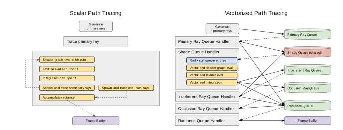
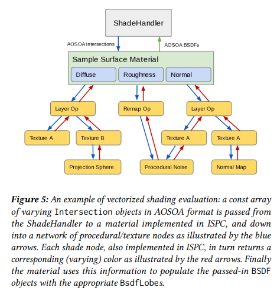
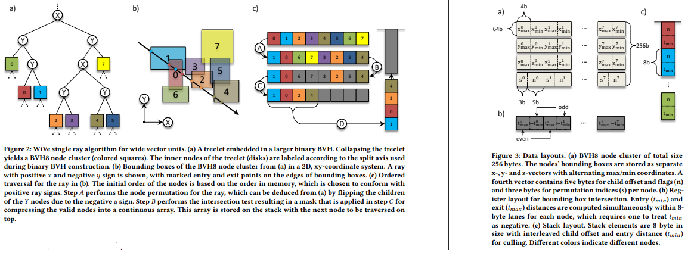

# Vectorized Path Tracing

## AVX/AVX2 Fundamentals

- **[Advanced Vector Extensions](https://en.wikipedia.org/wiki/Advanced_Vector_Extensions)**

## Embree Notes

- [Embree](https://github.com/RenderKit/embree/blob/master/kernels/bvh/bvh.h)

  - BVH has 8 children in an AVX2 enabled implementation
  - Intersection path

    - 1: [`rtcIntersect8`](https://github.com/RenderKit/embree/blob/ffc56d50a319c5eb3f246b3c8623f054514b06e6/kernels/common/rtcore.cpp#L820)
    - 2: call intersector given from BVH factory ([example](https://github.com/RenderKit/embree/blob/ffc56d50a319c5eb3f246b3c8623f054514b06e6/kernels/bvh/bvh8_factory.cpp#L232))
      we are interested in the `bvh_intersector_hybrid.h/cpp`, capable of switching between packet and single ray traversal (assume K = 8, N = 8).

## Paper 1: [Vectorized Production Path Tracing](https://stg-research.dreamworks.com/wp-content/uploads/2018/07/Vectorized_Production_Path_Tracing_DWA_2017.pdf)

*Queueing* is used to keep all vector lanes full and improve data coherency. It it implemented using a C extensions called
[ISPC](https://ispc.github.io/ispc.html#getting-started-with-ispc) (which basically is a compiler which autovectorizes the code given some intrinsics).
Hence, the path tracer here includes a C++ scalar version and a ISPC vectorized breadth-first wavefront version (look also into wavefront integrator of
PBRT for reference)

The followed approach is uni-directional path tracing [Kajiya 1986] with next event prediction [Pharr et al. 2016].

Path tracing is an inherently parallel, and therefore, it should exploit vectorized instructions and multiple cores.

- How do we access the vector hardware efficiently?
- How do we gather batches of work to keep the vector hardware busy?
- How do we avoid scatter gather and keep memory accesses coherent?

  - One step is transitioning from Array of Structs (AoS) to Struct of Arrays (SoA)

**Coherent Rendering** for ray tracing is necessary. Rendering systems therefore rely on spacial sorting, level of detail selection and streaming to efficiently pre-compute
spherical occlusions of out-of-core scenes



(the shared primary ray queue is not shown in the image)

Image generation is separated into 2 distinct phases:

1. **Preparation Phase**: load all assets and build the ray-tracing acceleration structure
2. **Rendering Phase**: execute the Monte Carlo asmpling and integration. *Here we focus our vectorization*

Overview of rendering phase:

- Partition image into small square pixel buckets, and sample primary rays from each
- Trace camera rays through the scene and trigger the execution of a surface shader (or inifinite light sampling if ray escapes)
- Compute BSDF closure, importance sample BSDF value
- *Next Event Estimation*: accumulate direct illumination + secondary ray, determined with Multiple Importance Sampling and Russian Roulette (path splitting). unimportant rays
  are culled.

The vectorized path is a feedforward breadth-first pipeline.

Multithreading here uses Intel's **Thread Building Blocks** (TBB) library.

- Memory allocations are confined to *thread local memory arenas* or pre allocated memory pools, to avoid synchronization stalls due to memory allocation
- Each Queue is split in multiple **Thread Local Storage** buffers, such that, each thread will use shared data in read-only (no synchronization needed) and its own TLS storage

Key to vectorization is **Queue Handling**. A Queue here is **NOT** a fifo buffer, but a memory area in which work is gathered. We use the term *flush* to denote the
following operations on a queue:

1. The entries are copied into a temporal arena and the queue is emptied or near empty (number of records removed is a multiple of the vector lane width)
2. The copied entries are **Sorted** (later)
3. Sorted result are sent to their associated queue handler for processing

All queues are preallocated. Furthermore, **Besides the shadow queue**, all other queues are *thread local* (see later why shadow queue is special).
To amortize the queue insertion cost, work items are **batched** and then added with a single call.

A queue is **flushed** when its work item count exceeds a predefined size, and the thread which inserted the last items is responsible for the flush. Note that a queue handler
can cause another queue to be filled up, causing another handler to be executed.

If a thread finds itself with no work to do, it asks the **shared work queue** for the next batch of primary rays to process.

As the frame is near completion, and work queues are never filled up, threads enter in *queue draining mode*, where manual flushes are performed. **Load balancing** is achieved
by having each thread empty their local queues first before moving onto flushing the shared shader queues, which may cause insertions in the local queues.

There are multiple queues in the system. Note that the graph contains a cycle betrween "Incoherent Ray Queue" and "Shade Queue" handlers

- Primary rays and incoherent rays are separated because since primary rays are generated by sampling screen space tiles, they are expected to have a certain degree of coherency.
- The occlusion ray queue is also separated because it is processed in Embree on a different code path
- **Shade queues** are the only type of queue which are shared between threads. One queue is allocated for each for each shader instance in the scene (for each type of material?)
  They are shared such that we need to allocate 1 queue per shader, not 1 queue per shader per thread

**Sorting**: Each queue accepts 64-bit entries composed of a 32-bit sort key and 32-bit payload reference. Queues are then sorted with the **Radix Sort** algorithm
using a less-than comparison on the sort keys. Queue sorting therefore operates on 64-bit entries. Here's the sort key used for shade queues

| **Bit Location** | **Contents**    | **Number of bits**      |
| ---------------- | --------------- | ----------------------- |
| 25-31            | light-set index | 7 bits = 128 light sets |
| 18-24            | UDIM tile       | 7 bits = 128 tiles      |
| 14-17            | mip level       | 4 bits = 16 mip levels  |
| 0-13             | uv coordinates  | 14 bits = 16,384 tiles  |

Inputs are fed in the SOA (Structure of Arrays) or AOSOA (Array of Structures of Array) format. Since sorting is preferably using AOS format, we go through a 2-step proces
before passing data to the vectorized (ISPC) code.

1. Sorting as described above
2. Take the sorted references to AOS inputs, fetch them and transform then into AOSOA packets (Note that since we grouped AOS structs into batches, we can use the prefetch
   instructions to improve cache utilization)

Note that once AOS struct inputs have been fetched, the conversion to AOSOA format is a matrix transpose operation, which can be vectorized with either SSE or AVX, depending
on the vector size.

- This procedure works fine for 32-bit data (`float`, `int`), but requires special handling with 64-bit data (pointers). In particular, we split the high and low parts of the
  pointer, and special code is needed to reconstruct the address before accessing memory.
- Memory alignment is also paramout to avoid unaligned load/store instructions, which are slower.

**Ray State Persistence**: since rays are queued in a breadth-first scheme, we need to store their state somewhere in memory. Recall that queue entries host a
*32-bit payload reference*. Such payload is an index inside a pool of pre-allocated `RayState` structuers. Such structure consists of

- Ray Differential information
- Current path throughput
- destination frame buffer specifics
- any other state needed while a ray is awaiting processing in a rayt queue or shade queue

These structures are backed in a lock-free memory pool. Any thread can allocate `RayState` (necessary for path splitting) and any thread can deallocate `RayState`s.

### Vectorization

`Embree` is used for vectorized ray intersections, hence the paper focuses on how to support *Vectorized Shading*, *Vectorized Texturing* and *Vectorized Integration*



**Vectorized Shading**: programmable shaders are parsed into a shader graph. **Material Shaders** are at the root of the shader graph hierarchy, where their output will describe
how the surface scatters light at an intersection point. Each BSDF is a **list of weighted BSDF lobes** (up to 8). Each geometry primitive is associated with 1 material instance.
Material layering is supported by specifiying a Mix Material which takes two amaterials as input and a user-controllable blend texture

The second type of shader is a **shader node**, which produces a color value used to modify the input parameters coming from the parent shader.

Both shader types take as input an `Intersection` object (the surface interaction in PBRT). which is passed to the root node and its descendant without modification. Observe
the image

- The *Shade Handler* constructs AOSOA Intersection object**s** from the list of `RayState` references
- Each lane of an `Intersection` contains differential geometry information of an hitpoint
- A single ISPC function, which also takes the TLS object of the handling thread (to perform lock-free memory allocation) is invoked once for the whole Intersection Bundle
- The *Shade Handler* allocates and initializes a `BSDF` object for each `Intersection` object it passes, and the shading functions will populate the 8 `BsdfLobe` objects
  Since each lobe is constructed from contitional expressions, possibly texture sampling, and may be absent, we store a mask to determine whether a lobe is active for a particular
  lane.

**Vectorized Texturing**: Uses `OpenImageIO` (OIIO) as the basis for texturing, which facilitates

- support of different texture formats
- runtime caching system to handle textures which don't fit in memory
- runtime texture sampling system on top of the image cache (previous bullet)

The Paper makes use of items 1 and 2 from OpenImageIO, as vectorized sampling is handlied in material evaluation.

When sampling a texture, the selected adjacent mip levels are determined using **texture defrivatives**. A single value is looked up from each mip and then linearly interpolated
(*Point Sampling*. why? Because the number of primary rays is supposed to be high). Note that the system falls back to vectorized bilinear filtering when texture magnification
is required, i.e. when we don't have enough resolution mip-map to satify the request.

**Vectorized Integration**: the ISPC integration kernel directly ingests batches of `BSDF` objects in AOSOA format from the shaders. BSDF are identical on all SIMD lanes, but
some things can vary

- parameters
- weights (of each BSDF lobe)
- lane maks

*Each Lane* corresponds to a small set of coherent ray hits using the same material shader and the same light-set

The vectorized integrator therefore proceeds as follows in a data parallel fashion:

- draw samples poertong all BSDF and light importance sampling, evaluate MIS weights in SIMD
- Path Splitting and Russian Roulette
- *Note 1*: Whenever we need to perform light importance sampling with textured lights requires a binary search in a Conditional Cumulative Distribution Function table which are
  different for each lane, which causes memory gather instruction leading to SIMD divergence
- *Note 2*: to handle spawning new rays, the ISPC integrator kernel uses a local arena buffer to fill out AOSOA `RayState` information, which is then enqueued by some C++ code,
  which also performs a AOSOA->AOS conversion
- the ISPC integration kernel also produces a list of occlusion rays, list of radiances to add to the frame buffer, all in AOSOA format, then converted to AOS in C++

Paper Rendering code Link: <https://github.com/dreamworksanimation/openmoonray>

## Paper 2: [Accelerated Single Ray Tracing for Wide Vector Units](https://web.cs.ucdavis.edu/~hamann/FuetterlingLojewskiPfreundtHamannEbertHPG2017PaperFinal06222017.pdf)

Using vector units for single ray tracing through Bounding Volume Hierarchies has been accomplished by increasing the **branching factor** of the acceleration structure to match the
vector lane width. Such increase requires a more complex **control flow**.

This paper proposes a vectorized traversal algorithm for a single ray which performs traversal in constant time. In addition this algorithm can serve as building block to construct
**packet traversal** for coherent rays.

Basic traversal with Binary Bounding Volume Hierarchies offers little data parallelism. 2 fundamental approaches have emerged to remedy this situation

1. Trace multiple (coherent) ray simultaneously
2. Increasing the BVH branching factor

Both approaches work only if certain constraionts apply: Tracing multiple rays works with vectorized instructions only if rays are **coherent**, meaning they traverse the same
nodes in the BVH. Increasing the BVH branching factor instead increases data parallelism, but reduces *culling efficiency*. These two approaches can be combined.

- **Multi-Branch BVH**: vectorized AABB intersection procedures, which requires **child ordering** and **stack operations**. Stack less traversal has been introduced later, which
  decreased the size of the ray state struct.
- **Ray Packets**: ray-bounding box intersections are performed for more rays at a time with vectorized instructions. Rays in a packet must be **coherent**, i.e. they follow
  the same traversal path. Usually, a Path Tracer switches between packet tracing and single ray tracing based on the level of coherency of a ray packet
- **Ray Streams**: technique to handle incoherent rays: for every traversal stem a stream of single rays is intersected with the same node and partitioned into **miss group**
  and **hit group**. On a binary BVH, rays need to be gathered from the stream, which is expansive, and multi-branch BVH reduce the number of gather operations
- **Child Accessing Heuristic**: accessing a node's children in **back-to-front** order is facilitated by either the *Distance Heuristic* or the *Sign Heuristic* (which are 100%
  accurate only in case of non overlapping bounding boxes)

  - *Distance Heuristic*: children are ordered by the distance from the ray's entry point on the node
  - *Sign Heuristic*: Use the ray direction signs to choose among precomputed children orderings, stored in a lookup table (local to the node or global per bvh)

### Single Ray Traversal

The single ray traversal algorithm is divided into steps

- **Ray setup**: pre-computation and register alignment with ray data
- **Inner node traversal**: Ray descends the BVH until it misses all the children or encounters a leaf. In the first case, proceed with *stack pop*, otherwise, *leaf intersection*
- **Leaf intersection**: Reduce the maximum ray distance $t_{max}$ to the closest intersection (if any), then proceed with *stack pop*
- **Stack pop**: takes the top node from the stack (if any), and determines whether its ray entry distance is within $t_{max}$. If not, pop the node. Continue with
  *inner node traversal*

*Inner Node Traversal* is the most expensive step, divided into 3 operations

- Bounding box intersection (slab test)
- Child ordering
- stack push



**Construction**: A multi-branch BVH can be constructed from a binary tree or natively. To collapse a binary BVH:

- the binary BVH is divided into treelets starting at the root node and following the branches with the *Largest Area First*.
- each time you "expand" a node, count the number of treelets intermediate nodes, and stop once you reach the desired branching factor
- the intermediate nodes form a node cluster, which is then ordered accouding to the chosen heuristic and inserted in the multi-branch BVH

**Traversal Algorithm**: Start at the root node, and check if current node is inner node or leaf. In the *first case*, traveerse the node cluster. Such function returns a list
of elements referencing intersected children and their entry distances. Push them onto the stack. In the *second case*, call the primitive intersection function, and if it's a
hit, **compress** the stack (ie remove all the nodes whose entry distance is bigger than $t_{far}$). Continue until the stack is empty. Pseudocode:

```python
def traverseRay(node, ray)
  stack = []
  while True:
    if node.isInner():
      elems, num = traverseCluster(node.cluster, ray)
      stack.push(elems, num)
    elif intersectLeaf(node, ray):
      stack.compress(ray.tfar)
    if stack.isEmpty():
      return
    node = stack.pop(1)
```

*Child ordering* during traversal relies on pre-computed traversal order for the nodes in each node cluster, where the appropriate order for a specific ray is selected based on
the signs of the ray's directional components (*Sign Heuristic*), hence 8 possible predetermined orders are required for each node cluster. A ttraversal order is a
**permutation vector**, and 8 of them are stored in each node cluster. This means that

1. the node elements are permuted accourding to the chosen permutation vector *(figure (A))*
2. Slab test, which produces an active mask *(figure (B))*
3. The mask is used to compress the active elements into a continuous array *(figure (C))*
4. continuous array is pushed into the stack *(figure (D))*

**Implementation**: BVH8 implementation for AVX2 (8x32 and 4x64 bits elements) and AVX-512 (16x32 and 8x64 bits elements) instruction sets. Key instructions for our algorithm are

- `vpermq a, b, c`: Copy elements from `c` selected by lower three bits in `b` to the corresponding position in `a`
- `vpcompressq a[k], b` (AVX-512 only): select elements from `a` using mask `k` and compress the selected elements to form a continuous array aligned with the low element in `a`

BVH8 node cluster: bounding boxes are stored as 3 separate buffers for each dimension, alternating min and max (figure). A fourth buffer stores 8x8-byte elements which encodes
permutation vector and node data.

- a permutation vector is composed of 8 3bit permutation indices, totaling 3 bytes in size
- the remaining 5 bytes are used for node data:

  - flag to indicate an inner node or a leaf
  - the corresponding child cluster or primitive cluster offset
  - a mask to identify valid nodes in a child cluster or the number of primitive clusters within a leaf

For the **slab test**:

- Three bounding box vectors (x, y, z) are loaded into vector registers
- If the sign of ray direction component is negative, the corresponding min and max in the vector registers will be swapped
- perform slab test in all eight nodes in parallel, computing $t_{max}$ and $-t_{min}$ in even and odd lanes respectively *(figure 3b)*

The following are the implemented equations:

$$
\begin{align*}
   t^{n,i}_{\text{max}} &= (b^{n,i}_{\text{max}} - o_i) * d^i     \\
   t^n_{\text{max}}     &= \min_{i = x, y, z} \; t^{n,i}_{\text{max}} \\
  -t^{n,i}_{\text{min}} &= (b_{n,i}^{\text{min}} - o^i) * -d^i    \\
  -t^n_{\text{min}}     &= \min_{i = x, y, z} \; -t^{n,i}_{\text{min}}
\end{align*}
$$

Where:

- $i$, $n$ denote the axis and node lane
- $o^i$ component of ray origin
- $b^{n,i}$ minimum and maximum bounding box after the swap
- $d^i$ is the inverse ray direction component (in the ray setup phase it can be alternatively inverted with $\left(-1\right)^n d^i$)
- $t^n_{max}$ and $-t^n_{min}$ are also clipped between $t_{near}$ (negated for min) and $t_{far}$

Next, the slab result are arranged with `vpermq` instruction according to the front-to-back traversal order stored in the node cluster. The **permutation vector** is extracted
from the fourth vector stored in the node cluster by **bitshifting with the concatenated sign bits of the ray direction** to obtain a vector composed of the three lower bits for
each 64-bits wide element. After the permutation step, the $(t_{max},-t_{min})$ pairs are ordered such that the first pair corresponds to the last active node lane in the register.

Next, we put $t_{max}$ and $t_{min}$ (negated) into two different registers in the odd lanes, such that we can compare $t_{max}$ and $t_{min}$ to obtain a mask which will set
an element full of ones if $t^n_{min} \leq t^n_{max}$.

Next, the permutation done on the slab results is repeated for the node data and then **node data and $t_{min}$ are interleaved in a single vector register**. Then, we perform
a masked compression `vcompressq` operation to obtain a contiguous array for elements which passed the slab test

```python
def traverseCluster(cluster, ray):
  bx, by, bz, node = cluster.load()
  if ray.sign.x: bx = swapEvenOdd(bx)
  if ray.sign.y: by = swapEvenOdd(by)
  if ray.sign.z: bz = swapEvenOdd(bz)
  tx = (bx - {ray.org.x}) * {-ray.idir.x, ray.idir.x}
  ty = (by - {ray.org.y}) * {-ray.idir.y, ray.idir.y}
  tz = (bz - {ray.org.z}) * {-ray.idir.z, ray.idir.z}
  t = min(tx, ty, tz, {-ray.tnear, ray.tfar})
  index = shift(node, {ray.sign.xyz})
  t = permute(t, index)
  tmax = swapEvenOdd(t)
  tmin = fligSignsOdd(t)
  mask = compare(tmin, tmax)
  node = permute(node, index)
  elems = interleaveOddOdd(node, tmin)
  elemes = compress[mask](elems)
  num = countBits(mask)
  return (elems, num)
```

Primitives in leaf nodes are packed into clusters with **4 primitives per cluster**. Once the traversal finds a leaf node, all clusters in the stack are tested, and when
an actual intersection is found we update the $t_{far}$ accordingly. Thus, nodes on the stack with $t_{far} < t_{min}$ may be removed.

This *Pruning* procedure may be implemented by loading 8 (64-bit) stack elements, starting from the bottom, performing the comparison, compression and storing the remaining
valid elements on the stack (2 scans)

For an **AVX2** based implementation (we considered AVX-512 thus far):

- $t_{min}$ and $t_{max}$ are no longer interleaved in the same vector register. Instead, they are stored separately...
- Therefore, the node layout is changed, having **8 32-byte AVX2 vectors**
- Since AVX2 does not provide a compress instruction, we emulate this operation with a permute instruction and a *table lookup using the slab test mask as index*

  - Since the mask is an 8-bit value, we need a table with 256 entries. Each entry is 3 bytes wide (8 3bit indices referencing one of 8 elements)
  - Decompression is performed by broadcasting an entry into an AVX2 register and shifting each lane by a different amount to align the corresponding index bits

**Any-Hit Traversal vs Multi-Hit Traversal**:

- Any-hit traversal is used **shadow rays** and can terminate as soon as an intersection with a primitive is found. For this type of query front-to-back order is not important
  and therefore specialized traversal orders are more efficient ([Paper on Sorting techniques](https://jcgt.org/published/0005/02/02/paper.pdf))
- Multi-Hit Traversal ([Paper](https://jcgt.org/published/0003/01/01/paper.pdf)) finds the first n closest intersections with primitives along a ray

### Coherent Traversal

Packet tracing is a ray tracing technique which uses vector instructions for groups of coherent rays having similiar origin and direction. The optimal packet size is defined
by vector width.

Packet tracing can also be combined with [frustum culling](https://graphics.stanford.edu/~boulos/papers/ia.pdf) to reduce the number of bounding box tests during traversal.

The idea in this paper is to combine multi-branch BVH traversal, Packet tracing, and **Interval Arithmetic**, meaning that the slab test will produce a $[t_{min}, t_{max}]$
interval. Origin and inverse direction are also expanded into intervals $[\underline{o}^i,\overline{o}^i]$

Basically, we want to model a packet of rays as a single ray with interval arithmetic origin and direction

```math
\begin{align*}
   t^{n,i}_{\text{max}} &= (b^{n,i}_{\text{max}}-\underline{o}^i) * \overline{d}^i \\
  -t^{n,i}_{\text{min}} &= (b^{n,i}_{\text{min}}-\overline{o}^i) * \underline{d}^i
\end{align*}
```

Assuming that the inverse direction interval **doesn't contain 0**, for each component.

If we are to trace multiple packets in parallel (because a set of coherent rays exceeds what the vector register can hold), we need a mechanism to track active
packets. We achieve this with a **First Packet Index** (FPI), initialized to the first element in the packet list.

- Bounding Box intersection starts in the FPI packet,
- if there'a a valid intersection, then all the other packets are assumed to hit the node as well.
- Otherwise, the first packet index is incremented until eitehr the first packet with a valid intersection is found, which will continue traversal, or
  all packets have been tested, triggering a stack-pop operation.

The assumption here is that packets have high coherence and therefore the behaviour of a packet is a good prediction for all the others. This method is well suited for primary rays

- The `traverseCluster` function here is performed on an interval ray
- The stack, instead of containing (child reference, $t_{min}$), it also contains the FPI
- after an intersection, if the stack is empty then we're done, otherwise intersect the popped node with the popped FPI packet onwards until you reach the end or hit a valid
  intersection

```python
def traversePackets(node, packets):
  stack = []
  ray = packets.intervalRay()
  while True: outerloop:
    if node.isInner():
      elems, num = traverseClusterInterval(node.cluster, ray)
      stack.push(elems, num, packets.fpi())
    else:
      intersectLeaf(node, packets) # no stack compression based on tfar?
    while True:
      if stack.isEmpty(): return
      node, fpi = stack.pop()
      packets.setNext(fpi)
      do:
        if intersect(node, packets.current()):
          goto outerLoop
      while packets.next();
```

## Paper 3: [Getting Rid of Packets](https://graphics.stanford.edu/~boulos/papers/multi_rt08.pdf)

## Paper 4: [Local Shading Coherence Extraction for SIMD-Efficient Path Tracing on CPU](https://www.embree.org/papers/2016-HPG-shading.pdf)

## Paper 5: [Geometric and Arithmetic Culling Methods for Entire Ray Packets](https://graphics.stanford.edu/~boulos/papers/ia.pdf)

## Paper 4: [Understanding the efficiency of Ray Traversal on GPUs](https://research.nvidia.com/sites/default/files/pubs/2009-08_Understanding-the-Efficiency/aila2009hpg_paper.pdf)

## Paper 6: [GPU RaySorting](https://meistdan.github.io/publications/raysorting/paper.pdf)

## Notes with chatGPT

Vectorized Path tracing makes use of work queues to group work by similarity, such that clusters of work can be dispatched with vectorized instructions.

Rays, in particular, can be inserted in a given queue and sorted by origin, direction and other characteristics.

Ray packets are efficient if rays behave similiarly. THat is, if they traverse the same BVH nodes and hit similiar surfaces

- If rays in a packet hit different surfaces, or branch differently (reflection, transmission, scattering), they can *diverge*
- Divergence means masked warp execution on a CUDA GPU, and
  [conditional operations on AVX2](https://stackoverflow.com/questions/74454057/how-to-do-mask-conditional-branchless-arithmetic-operations-in-avx2)

1. **Use coherent rays whenever possible**: Camera rays and shadow rays are often coherent, while secondary rays (reflection, transmission) are not. meaning you need to
   implement a fallback
2. **Packet Tracing with Masked Execution**: use a mask to know which rays are active. For branching, evaluate different branches with a mask
3. Sort/Group rays by Direction/Material (as done by [embree](https://github.com/search?q=repo%3ARenderKit%2Fembree+__AVX+path%3A%2F%5Ekernels%5C%2Fbvh%5C%2F%2F&type=code))
